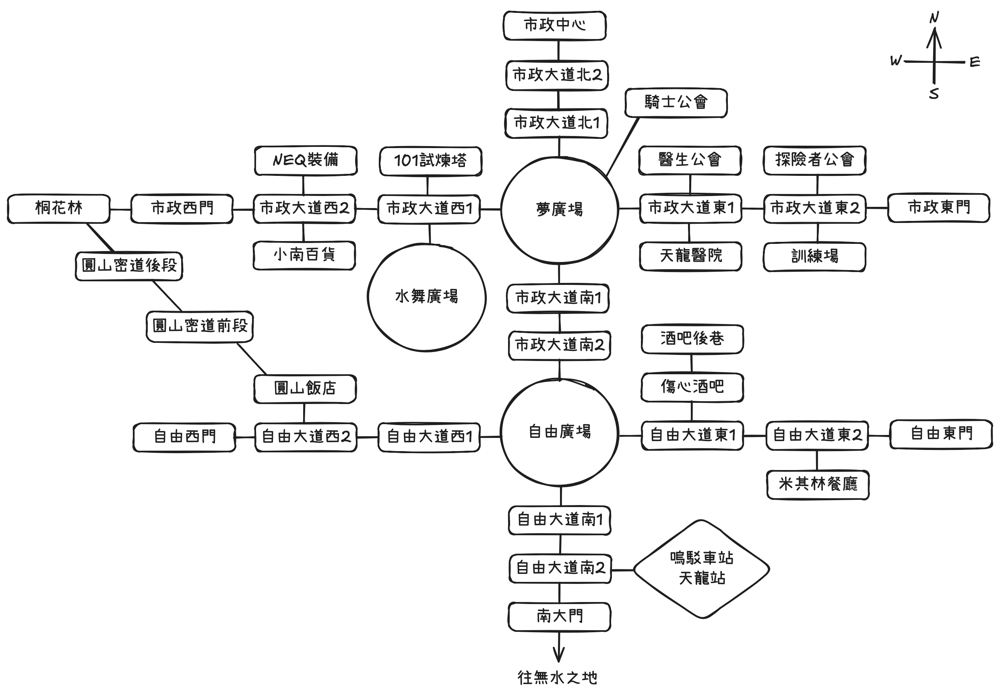

# 平行時空的台灣 WebMUD 地圖

## 世界觀

平行時空的台灣是一個融合了台灣地理特色與奇幻元素的 MUD 世界。天龍城作為台灣大陸的第一大城，是冒險的起點。

---

## 🏙️ 台灣大陸整體結構圖

```         
            [慶記之地]   [後花園森林]
               (WN)↖    ↗(EN) 
   [風城]          [天龍城]
      ↖(WN)          ↓(S)
      [航空城]←(W)[無水之地](E)→[山海隘口]
                     ↓(S)        ↓(S)
                  [海港城]       [古城] 
```

## 台灣大陸各地區說明

### 天龍城 (taipei_city)
- **說明**: 台灣大陸第一大城，是台灣經濟與政治的中心，也是各個公會的起源地，這座充滿科技感的現代化城市，擁有完善的道路系統和豐富的設施
- **鄰近地區**：西北→兵工廠, 東北→後花園, 南→無水之地

### 海港城 (kaohsiung_city)
- **說明**: 台灣大陸第二大城，因近海逐漸發展成港口，成為海上交通的樞紐，是許多商隊與冒險者的聚集地
- **鄰近地區**：北→無水之地

### 航空城 (taoyuan_city)
- **說明**: 台灣大陸第三大城，空中交通的樞紐，是其他地區到風城的唯一入口，因為是飛行裝置的產地，可以看到天空上有著滿滿的飛行裝置
- **鄰近地區**：東→無水之地, 西北→風城

### 風城 (hsinchu_city)
- **說明**: 一座位於天空上的城市，又稱天空之城，因長年受到強風吹拂且不易抵達，所以成為能夠操控風且喜愛寧靜的魔法師最愛的住所
- **鄰近地區**：東南→航空城

### 古城 (tainan_city)
- **說明**: 充滿古文明的城市，也是目前唯一完整保有古老特色的城市，住民都崇尚最自然的生活，拒絕與高科技為伍
- **鄰近地區**：北→山海隘口

### 後花園森林 (yilan_garden_forest)
- **說明**: 又稱天龍城的後花園，是天龍城居民休閒時間最常去的地方，整個地區完全都被森林覆蓋，爲此地蒙上了神秘的面紗
- **鄰近地區**：西南→天龍城

### 慶記之地 (taichung_land)
- **說明**: 台灣大陸的兵器製造中心，有許多不同幫派成立的兵工廠，幫派與政府間複雜的利益糾葛，讓這邊成為了法外之地
- **鄰近地區**：東南→天龍城

### 無水之地 (nantou_land)
- **說明**: 台灣大陸往各大城的必經之路，是一片長年缺水的土地，鮮少有生物能在這生存，是克里斯托石的產地
- **鄰近地區**：北→天龍城, 南→海港城, 西→航空城, 東→山海隘口

### 山海隘口 (hualien_pass)
- **說明**: 台灣大陸的主要防衛關口，也是其他大陸要進入台灣的唯一要道，由高山跟海洋組成的天然屏障，長時間守護著台灣大陸
- **鄰近地區**：西→無水之地, 南→古城

---

## 天龍城區地圖



## 天龍城各區域說明

### 🏛️ 市政北區

#### 市政中心 (civic_center)
- **說明**: 天龍城的政治中心，宏偉的建築展現著城市的權力與榮耀。
- **功能**: 了解城市政策
- **連接**: 南→市政大道北2

#### 市政大道北1 (civic_boulevard_north1)
- **說明**: 通往市政中心的主要道路
- **功能**: 
- **連接**: 南→夢廣場, 北→市政大道北2

#### 市政大道北2 (civic_boulevard_north2)
- **說明**: 接近市政中心的路段
- **功能**: 
- **連接**: 南→市政大道北1, 北→市政中心

#### 夢廣場 (dream_plaza)
- **說明**: 天龍城的中心廣場，是市民聚集和商業活動的核心區域。這裡是城市的交通樞紐，四通八達。
- **功能**: 
- **連接**: 東→市政大道東1, 南→市政大道南1, 西→市政大道西1, 北→市政大道北1, 東北→騎士公會

#### 騎士公會 (knight_guild)
- **說明**: 宏偉的騎士大廳，牆上掛滿了各種武器和盔甲。
- **功能**: 
- **NPC**: 公會長
- **連接**: 西南→夢廣場

### 🏛️ 市政東區

#### 市政大道東1 (civic_boulevard_east1)
- **說明**: 夢廣場往東延伸的道路
- **功能**: 
- **連接**: 東→市政大道東2, 南→醫院, 西→夢廣場, 北→醫生公會

#### 醫生公會 (healer_guild)
- **說明**: 充滿草藥香氣的醫館，各種藥材整齊排列。
- **功能**: 
- **NPC**: 公會長
- **連接**: 南→市政大道東1

#### 天龍醫院 (taipei_hospital)
- **說明**: 天龍城的主要醫院，提供醫療服務。
- **功能**: 
- **連接**: 北→市政大道東1

#### 市政大道東2 (civic_boulevard_east2)
- **說明**: 夢廣場往東延伸的道路
- **功能**: 
- **連接**: 東→市政東門, 南→訓練場, 西→市政大道東1, 北→探險者公會

#### 探險者公會 (adventurer_guild)
- **說明**: 一個充滿冒險氛圍的大廳，牆上掛滿了各種地圖和探險工具。
- **功能**: 
- **NPC**: 公會長
- **連接**: 南→市政大道東2

#### 訓練場 (training_field)
- **說明**: 專門用於訓練的場地，有訓練假人供練習。
- **功能**: 安全地練習技能
- **NPC**: 訓練假人
- **連接**: 北→市政大道東2

#### 市政東門 (civic_east_gate)
- **說明**: 通往後花園森林
- **功能**: 
- **NPC**: 衛兵
- **連接**: 

### 🏛️ 市政西區

#### 市政大道西1 (civic_boulevard_west1)
- **說明**: 夢廣場往西延伸的道路
- **功能**: 
- **連接**: 東→夢廣場, 南→水舞廣場, 西→市政大道西2, 北→101試煉塔

### 101試煉塔 (tower101)
- **說明**: 高聳入雲的試煉塔，是冒險者們測試實力的地方。
- **功能**: 
- **連接**: 南→市政大道西1

### 水舞廣場 (water_plaza)
- **說明**: 美麗的水舞廣場，是市民休閒的好地方。
- **功能**: 
- **連接**: 北→市政大道西1

#### 市政大道西2** (civic_boulevard_west2)
- **說明**: 夢廣場往西延伸的道路
- **功能**: 
- **連接**: 東→市政大道西1, 南→道具店, 西→市政西門, 北→裝備店

### NEQ裝備 (equipment_shop)
- **說明**: 販賣各種裝備的商店，從基礎裝備到高級裝備應有盡有。
- **功能**: 購買或出售裝備
- **連接**: 南→市政大道西1

### 小南百貨 (item_shop)
- **說明**: 販賣各種道具的商店。
- **功能**: 購買藥水、食物等道具
- **連接**: 北→市政大道西2

#### 市政西門 (civic_west_gate)
- **說明**: 出城後就是往慶記之地的方向
- **功能**: 
- **NPC**: 衛兵
- **連接**: 西→桐花林

### 🏛️ 市政南區

#### 市政大道南1 (civic_boulevard_south1)
- **說明**: 夢廣場往南延伸的道路
- **功能**: 
- **連接**: 南→市政大道南2, 北→夢廣場

#### 市政大道南2 (civic_boulevard_south2)
- **說明**: 夢廣場往南延伸的道路
- **功能**: 
- **連接**: 南→自由廣場, 北→市政大道南1

#### 自由廣場 (liberty_plaza)
- **說明**: 天龍城的商業廣場，到處都是商店和攤販，充滿活力。
- **功能**: 
- **連接**: 東→自由大道東1, 南→自由大道南1, 西→自由大道西1, 北→市政大道南2

### 🏛️ 自由東區

#### 自由大道東1 (liberty_boulevard_east1)
- **說明**: 自由廣場往東延伸的道路
- **功能**: 
- **連接**: 東→自由大道東2, 西→自由廣場, 北→傷心酒吧

#### 傷心酒吧 (sad_bar)
- **說明**: 天龍城著名的酒吧，是冒險者們聚集交流的地方。
- **功能**: 招募傭兵
- **NPC**: 酒吧老闆
- **連接**: 南→自由大道東1, 北→酒吧後巷

#### 酒吧後巷 (bar_alley)
- **說明**: 連接傷心酒吧的後巷，有些陰暗。
- **連接**: 南→傷心酒吧

#### 自由大道東2 (liberty_boulevard_east2)
- **說明**: 自由廣場往東延伸的道路
- **功能**: 
- **連接**: 東→自由東門, 南→米其林餐廳,西→自由大道東1

#### 米其林餐廳 (michelin_restaurant)
- **說明**: 位於天龍城的餐廳，提供精緻美食。
- **功能**: 
- **連接**: 北→自由大道東2

#### 自由東門 (liberty_east_gate)
- **說明**: 通往後花園森林
- **功能**: 
- **NPC**: 衛兵
- **連接**: 

### 🏛️ 自由西區

#### 自由大道西1 (liberty_boulevard_west1)
- **說明**: 自由廣場往西延伸的道路
- **功能**: 
- **連接**: 東→自由廣場, 西→自由大道西2

#### 自由大道西2 (liberty_boulevard_west2)
- **說明**: 自由廣場往西延伸的道路
- **功能**: 
- **連接**: 東→自由大道西1, 西→自由西門, 北→圓山飯店

#### 圓山飯店 (grand_hotel)
- **說明**: 天龍城最豪華的飯店，提供住宿服務
- **功能**: 所有玩家的出生點和復活點，可以休息、存檔 (輸入 `save`)、恢復體力
- **連接**: 南→自由大道西2, 西北→圓山密道

#### 圓山密道前段 (grand_tunnel_front)
- **說明**: 圓山飯店到桐花林的秘密通道，早期戰爭時逃難用，現已廢棄
- **功能**: 
- **連接**: 東南→圓山飯店, 西北→圓山密道尾段

#### 圓山密道尾段 (grand_tunnel_end)
- **說明**: 圓山飯店到桐花林的秘密通道，早期戰爭時逃難用，現已廢棄
- **功能**: 
- **連接**: 東南→圓山密道前段, 西北→桐花林

#### 自由西門 (liberty_west_gate)
- **說明**: 通往慶記之地
- **功能**: 
- **NPC**: 衛兵
- **連接**: 

### 🏛️ 自由南區

#### 自由大道南1 (liberty_boulevard_south1)
- **說明**: 自由廣場往南延伸的道路
- **功能**: 
- **連接**: 南→自由大道南2, 北→自由廣場, 

#### 自由大道南2 (liberty_boulevard_south2)
- **說明**: 自由廣場往南延伸的道路
- **功能**: 
- **連接**: 東→烏泊車站天龍站, 南→南大門, 北→自由大道南1

#### 烏泊車站天龍站 (mrt_taipei_station)
- **說明**: 天龍城的交通樞紐，可以快速前往城市各個區域。
- **功能**: 通過地鐵快速移動
- **連接**: 西→自由大道南2

#### 南大門 (south_gate)
- **說明**: 通往無水之地
- **功能**: 
- **NPC**: 衛兵
- **連接**: 

### 🏛️ 城外西區

#### 桐花林 (south_gate)
- **說明**: 通往慶記之地
- **功能**: 
- **NPC**: 
- **連接**: 東南→圓山密道尾段

---